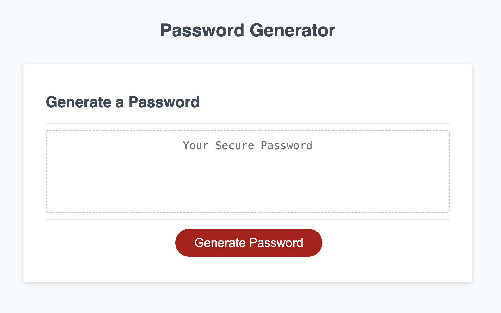

# passwordgenerator
Bootcamp Homework 3: Password Generator (Javascript)

## My Password Generator

In this project, we were asked to modify a starter code to create an application that generate random passwords based on the user's answers to the prompt questions. 

The following are the questions asked of the user:

Prompt Q1: How many characters do you want the password to be?

In this question, I've set the minimum characters to 8. If user input is less than 8, an error message will pop up. 
Error Message: "Character length has to be a number, 8 - 128 digits. Please try again." 
If user input is >= 8, the user will get prompted with question 2. 

  

Prompt Q2: Do you want lowercase letters in your password?

The user can click "Cancel" or "OK." Cancel will not include lowercase letters in the password. OK will include lowercase letters in the password.

Prompt Q3: Do you want uppercase letters in your password?

The user can click "Cancel" or "OK." Cancel will not include uppercase letters in the password. OK will include uppercase letters in the password.

Prompt Q4: Do you want special characters in your password?

The user can click "Cancel" or "OK." Cancel will not include special characters in the password. OK will include special characters in the password.

Prompt Q5: Do you want numbers in your password?

The user can click "Cancel" or "OK." Cancel will not include numbers (0-9) in the password. OK will include numbers (0-9) in the password. 

 

After all 5 questions are answered, the auto generated password will display in the generate password field.

The process repeats when the **"Generate Password" button** is clicked by the user.

## URLs Submitted

* URL of Application: https://lenzlee.github.io/passwordgenerator

* URL of GitHub Repo: https://github.com/lenzlee/passwordgenerator

## Resources

I referred to our Javascript lessons and activities for this assignment. 

I also used MDN web docs for reference when using the Math.random() static method, isNaN() function, and concat() method. 

## Screenshot

